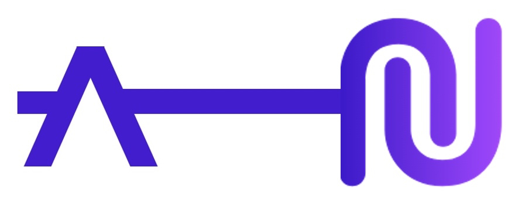
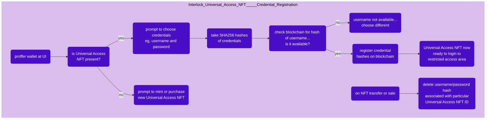

# Universal Access NFT (Sponsored by Aleph Zero)



The Interlock Universal Access NFT is a scheme for licensing and managing access permissions via ownership of a novel PSP34 NFT. **This project is sponsored by the [Aleph Zero](https://alephzero.org) Grant Program and is intended to provide this licensing/access scheme as a general framework to the Aleph Zero community at large.** The NFT used in this project is compatible with the [Art Zero](https://artzero.io) marketplace.

## [View the Universal Access NFT contract here](https://github.com/interlock-network/interlock-smartcontracts/tree/master/contract_uanft)

## [View the Universal Access NFT contract docs here](https://interlock-network.github.io/interlock-smartcontracts/contract_uanft/docs/uanft/)

#### Implementing this system in production presumes knowledge of the following:
 - [PSP43 NFT standard (ERC721)](https://github.com/w3f/PSPs/blob/master/PSPs/psp-34.md)
 - [ink! 4](https://use.ink/4.0.0/)
 - [openbrush 3](https://docs.openbrush.io)
 - [Polkadot{.js}](https://polkadot.js.org/docs/)

But you can follow along with the demonstration application anyways.

#### Possible Universal Access NFT applications:
- username/password management
- api key management
- two factor authentication
- software licensing
- general secret management

This is all possible without use of a traditional database (alas the blockchain is, technically a database).

#### In this repository:

You will find the following:

1) suite of node.ts application and server scripts (compiled to .js and ready to run)
2) archived demo application version that relies on micropayements to authenticate

As this is a _general_ framework, it will be up to you to create your own UI frontend. To experience a minimal application of a Universal Access NFT, get started with the demonstration CLI app below:

# Getting started with demonstration:

This is a demonstration of how the Universal Access NFT can manage username and password credentials for restricting access to a server that will only serve content to users who have demonstrated that they own a Universal Access NFT.

This repository contains all `node_modules` and `.env` files in order to make the demonstration experience as seamless as possible.

First, you will need to open up your terminal and setup a couple things:

### (1) - install git:

You need git first. Make sure you have it.

##### mac

```
brew install git
```
or
##### most linux

```
sudo apt install git
```

### (2) - install node.js:

Now you need to make sure you have node.js

##### mac

```
brew install node
```
or
##### most linux

```
sudo apt install nodejs
```
Now please verify that you are using a suitable version of node.js. Run:

```
node --version
```
The demonstration application will work on version `v14.` and higher.

If you are having trouble installing node.js, try visiting the website and download installer from there. Go to
[node.js install downloads](https://nodejs.org/en/download/) to find the installation package right for your machine.


### (3) - clone this repository:

Finally, clone this repository to your computer and navigate to it:

```
git clone https://github.com/interlock-network/universal-access-nft-demo;
cd universal-access-nft-demo
```
Now we can run the demonstration application!


# Run the demonstration:

We need to spin up one server, and one client application.

### (1) - RESTRICTED ACCESS SERVER:

From this directory (`username/universal-access-nft-demo`), run:

```
cd demonstration/restrictedAccessServer;
node --expose-gc accessArea.js
```

Create a new terminal instance in a new tab, making sure it is in the `universal-access-nft-demo` directory. Start up the restricted access area server. This server is responsible for receiving access credentials over https connection and verifying that their hashes match the hashes that were stored on the blockchain during the NFT credential registration process. This restricted access area server serves content that only verified Universal Access NFT holders have access to. In practice, this server could serve the entire experience, or it may simply issue an authentication token for proffer elsewhere. In this case, the server recieves a login request, it checks credentials, then grants or denies access to the restricted area. Run:

### (3) - CLIENT APPLICATION:

From this directory (`username/universal-access-nft-demo`), run:

```
cd demonstration/clientApplication;
node main.js
```

Finally we can start up the client application. Create a new terminal instance in this same `universal-access-nft-demo` directory. You could detach the terminal and place it side-by-side with the server terminal if you want to soak in all the play-by-play action at once.

Navigate the menu options to explore the minting, credential registration, and login process for the Universal Access NFT framework.:

# How this framework works:

### In short form:

1) user purchases/receives Universal Access NFT (UANFT)
2) owner registers on blockchain credentials SHA256-hashed by client application, proving UANFT ownership with signature
3) UANFT owner announces login/access attempt to restricted area hosted by contract owner's secure server
4) UANFT owner submits credentials over secure https connection to restricted access area server
5) server takes SHA256 hashes of credentials and discards unhashed credentials
6) server fetches original credential hashes that were stored on blockchain during registration transaction
7) server compares fetched credential hashes against login attempt credential hashes
8) if hashes match, server serves restricted access area content
9) if owner ever transfers UANFT to new owner, then credential hashes are removed from blockchain storage
10) if old owner tries to login to secure restricted area again after transfer, attempt will fail

### In visual form:

This series of flowcharts is for the case where a UANFT manages usernames and passwords.

#### This flowchart outlines the credential registration process:



#### This flowchart outlines the login process:

```mermaid

flowchart TD


style Interlock_Universal_Access_NFT_____Login fill:#dabded,stroke:#dabded,stroke-width:4px,color:#000

subgraph Interlock_Universal_Access_NFT_____Login

loginui(Universal Access NFT<br>owner visits login UI) --> uiprompt(login UI prompts owner for<br>username and password)
uiprompt --> secureconnect(login UI establishes secure connection<br>with restricted access area server)
secureconnect --> sendcred(login UI sends credentials to<br>secure restricted access area server)
sendcred --> serverhash(server takes SHA256 hashes<br>of username and password)
serverhash --> credget(server gets password hash associated<br>with username hash stored on blockchain)
credget --> userhashpresent(is the username hash present<br>on the blockchain?)
userhashpresent --> |no|notpresent(credentials wrong or nonexistent)
userhashpresent --> |yes|yespresent(credentials exist and password<br>hash successfully fetched)
yespresent --> passmatch(do password hashes match?)
passmatch --> |no|wrongpass(password incorrect)
passmatch --> |yes|rightpass(password correct)
rightpass --> accessgranted(restricted access area server<br>grants access to Universal<br>Access NFT owner)
accessgranted --> serve(begin serving privileged content)

end


style loginui fill:#490ec7,stroke:#490ec7,stroke-width:4px,color:#fff
style uiprompt fill:#490ec7,stroke:#490ec7,stroke-width:4px,color:#fff
style secureconnect fill:#490ec7,stroke:#490ec7,stroke-width:4px,color:#fff
style sendcred fill:#490ec7,stroke:#490ec7,stroke-width:4px,color:#fff
style serverhash fill:#490ec7,stroke:#490ec7,stroke-width:4px,color:#fff
style credget fill:#490ec7,stroke:#490ec7,stroke-width:4px,color:#fff
style userhashpresent fill:#490ec7,stroke:#490ec7,stroke-width:4px,color:#fff
style notpresent fill:#490ec7,stroke:#490ec7,stroke-width:4px,color:#fff
style yespresent fill:#490ec7,stroke:#490ec7,stroke-width:4px,color:#fff
style passmatch fill:#490ec7,stroke:#490ec7,stroke-width:4px,color:#fff
style wrongpass fill:#490ec7,stroke:#490ec7,stroke-width:4px,color:#fff
style rightpass fill:#490ec7,stroke:#490ec7,stroke-width:4px,color:#fff
style accessgranted fill:#490ec7,stroke:#490ec7,stroke-width:4px,color:#fff
style serve fill:#490ec7,stroke:#490ec7,stroke-width:4px,color:#fff

```



### In long form:

Access permission credentials are earned by purchasing or otherwise holding a PSP34 Universal Access NFT (UANFT). Each instance of the UANFT contract handles its own type of application access permissions. For example, one may with to manage access to a VIP online chatroom, so one will instantiate a UANFT contract to manage usernames and passwords for granting UANFT holders access on login. Or, one may wish to issue 2FA tokens that UANFT holders can store in their browser to enable some sort of browser extension functionality. There are numerous possible applications, hence the _universal_ quality.

Once somebody acquires a UANFT for a particular access type, they may then register the appropriate credentials for their access type. Again, this may be username/password, or an API key, software license, etc. The registration operation happens exclusively on the blockchain with no need for a transaction relay server.

When a UANFT owner wishes to register, they simply connect their wallet containing the UANFT to a client registration application (which may be a website, a browser extension, etc). At this point, they choose a username that has not been taken, and a password. Within the client application, these credentials are hashed via SHA256 then discarded. The UANFT owner then signs and submits the registration transaction, thus sending the anonymized credentials to the blockchain.

On the blockchain, the `register()` message verifies that the signer owns the UANFT ID being registered, then checks that the username hash has not already been taken. If it has been taken by a diffent UANFT ID, then this is somebody else's username and the transaction fails. If the username has been taken by the same UANFT ID, then the signer is simply registering a new password hash. If username hash is available, then the pair of SHA256 credential hashes submitted with the transaction are stored on-chain and associated with that particular UANFT ID.

Now, whenever the UANFT owner wishes to access or login to the restricted area, they will contact the server that manages authentication for that area (perhaps serving a chatroom), and then they will send their username and password over a secure https connection to the server for authentication. When the server recieves the login request with the username and password, it then calculates the SHA256 hash of each. Next, it fetches the username/password hashpair that was stored on the blockchain during the registration process. If the login attempt username hash cannot be found on the blockchain, then the access credentials do not exist or are incorrect. If the login attempt username hash exists and the password hash matches the record on-chain, then the access credentials are valid and the server begins serving the restricted access area content to the privileged UANFT owner.

It is important to note that credential information (either identifying or secret) is never stored in a traditional database. The only information that is stored are the anonymized credential SHA256 hashes on the blockchain.

In the event that a UANFT owner wishes to transfer or sell their UANFT to a different owner, the transfer message reimplementation on-chain removes the prior owner's credentials from contract storage thus revoking the old owner's access to the privileged restricted access area. If there is a concern that a malicious actor may purchase a UANFT with an identified username and impersonate that old username, then the smart contract may be configured to retain old username hashes in contract storage.

The ultimate goal is to eliminate the need to send secrets to the restricted access server that checks access-request hashes against those stored on-chain. This will ultimately be accomplished by some sort of zero-knowledge proof scheme.
